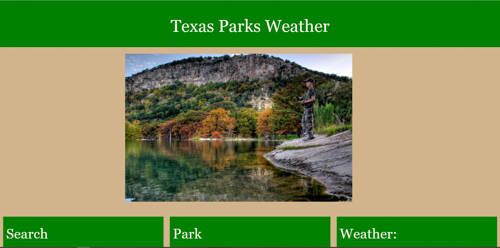
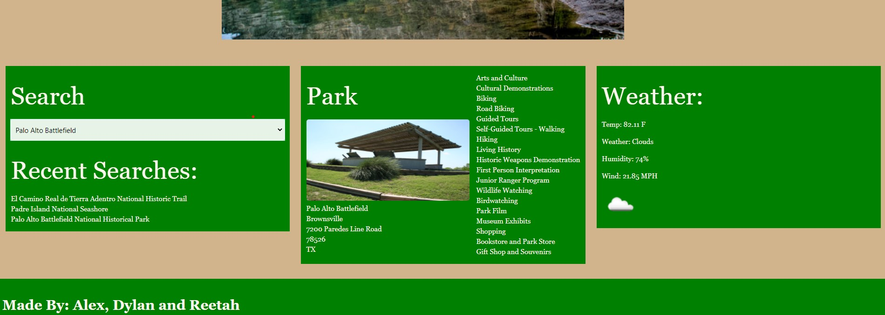
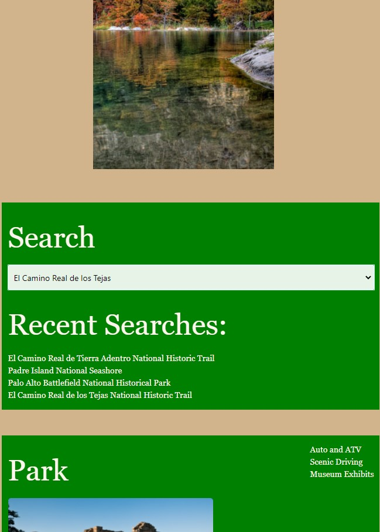

# Texas Park Weather

## Purpose
Creating a weather app using OpenWeather API and National Park Service API to view current weather and 5-day forecast for a selected Texas Park.

## Built With
* HTML
* CSS
* JavaScript
* Materialize
* Local Storage
* OpenWeather API
* National Park Service API

## Texas Park Weather
* Planning to go to a certain park in Texas? Here's an app to find out more information about the park and help you prepare for the weather.
* Description: A website to help you check the weather for certain park location here in Texas. 
* Motivation for development: Whether you are planning a full day hike or a weekend getaway camping, plans can easily be ruined if no one is prepared for unexpected weather changes.

## Requirements/Notes
* AS A frequent park-goer
* I WANT to check on current conditions of the parks in Texas
* SO THAT I can plan a trip accordingly
* GIVEN a dropdown list with parks
* WHEN I select a certain city
* THEN I am presented with park information and current weather

## Breakdown of tasks and roles
* Dylan: Park API, JavaScript, Local Storage, HTML, Park activities/pictures
* Reetah: Styling, HTML, CSS, Materialize, Presentation
* Alex: Weather API, JavaScript, Local Storage, HTML, Unordered List, ReadME

## Directions for future development
* Future proposals include expanding this website to show national parks in other states.
* Helpful links on safety precautions in case you find yourself stranded during any unforeseen weather changes.
* Helpful information on what can you do should you need medical attention.
* Dropdown section: search by current location, find out which park you are closest to.
* Parks section: add activities that park has available (kayaking, biking, camping, dogs allowed, etc).
* Weather: add 5-day forecast, link to weather map.

## Link
https://christenson10.github.io/TexasParkWeather/

## Pictures

## Hero Image and 3 Sections

## Search History, Drop Down, Park Info and Weather Display

## Mobile Responsive
